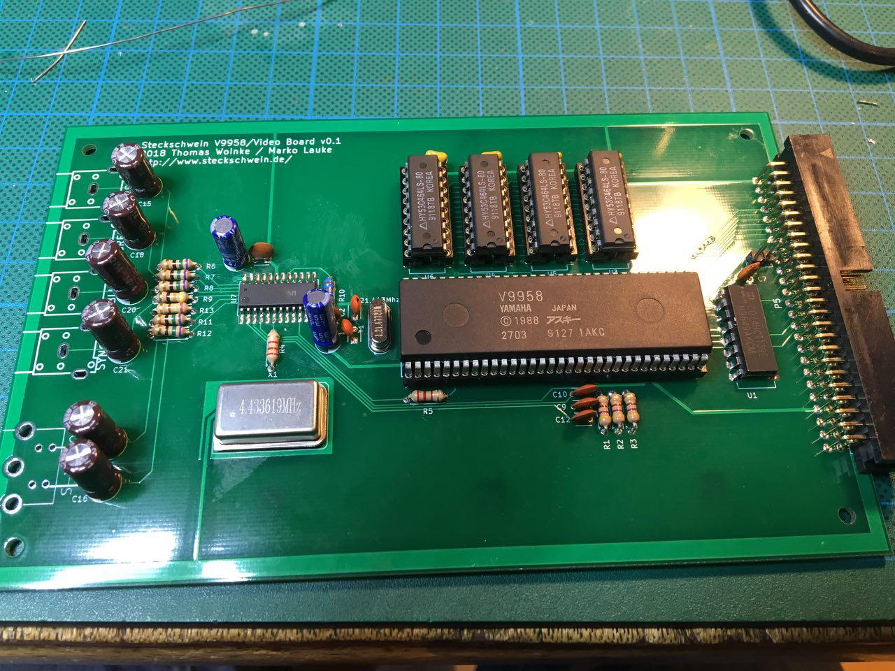
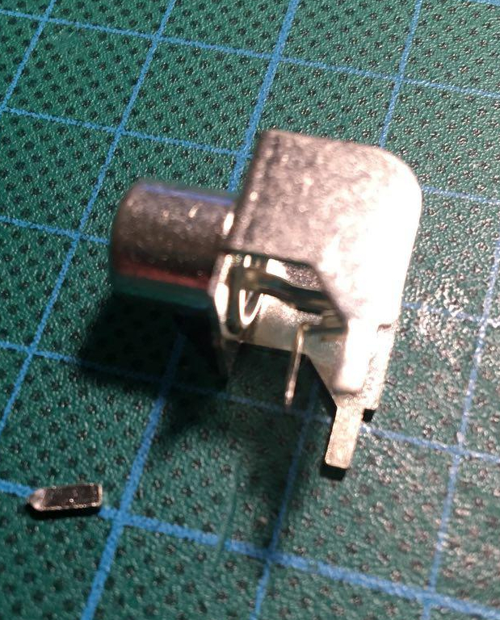
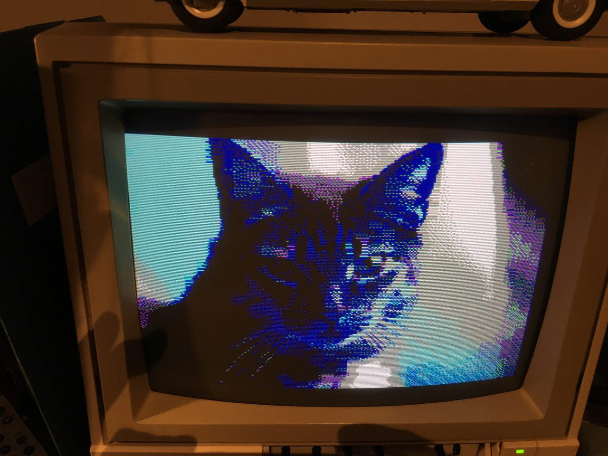
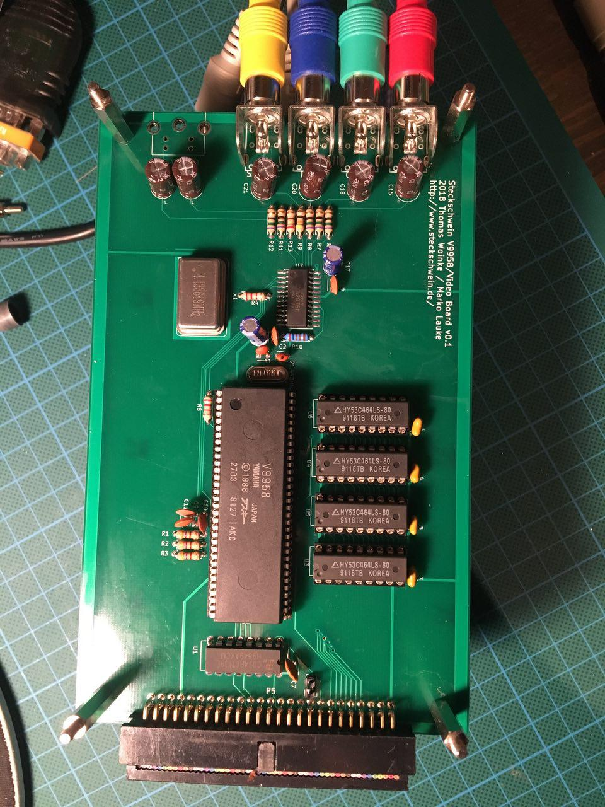

Da ist sie nun, die neuen Videoplatine. Nach einigen Umwegen hat der Packen Boards uns erreicht (die erste Lieferung ist versehentlich in Spanien gelandet, während wir die Platinen des spanischen Bastlers erhalten haben. Inzwischen hat jeder Ersatz erhalten).

Wir haben ja bekanntlich [unsere Vorgehensweise geändert](http://steckschwein.de/2018/03/01/v9958-vom-steckbrett-zum-prototypen/), indem wir schneller Platinen anfertigen lassen. Aber zu unserer großen Freude funktionierte die erste Platine nach Bestückung auf Anhieb. Selbstverständlich haben sich aber auch ein paar Patzer eingeschlichen.

\[caption id="attachment\_996" align="alignnone" width="1280"\] Die bis auf die Chinch-Buchsen fertig aufgebaute Platine\[/caption\]

Zunächst gabs wohl eine Verwechslung bei den Footprints für die Chinch-Buchsen. Unsere vorhandenen Buchsen passen also nicht, nirgends lassen sich passende Buchsen auftreiben. Wieso hat KiCad Footprints, die zu keinen Komponenten passen? Was nicht passt, wird passend gemacht, also müssen die Buchsen wohl etwas bearbeitet werden.

\[caption id="attachment\_998" align="alignnone" width="379"\] Passend gemachte Buchse. Der vordere Pin wurde abgeknipst, und der mittlere Pin etwas nach vorne gebogen.\[/caption\]

Nach erfolgreichem Test hat sich dann ein weiteres Problem offenbart.

\[caption id="attachment\_1036" align="alignnone" width="1280"\] Irgendwie wirken die Farben vertauscht\[/caption\]

Dadurch, dass der V9958 seine Video-Ausgabepins für die Farbkanäle nicht in der Reihenfolge RGB, sondern GRB angeordnet hat, sind im Schaltplan Rot und Blau verwechselt worden. Glücklicherweise gehen die Farbsignale über Koppelkondensatoren an den CXA2075M, sodass der Fix erstmal darin besteht, C9 und C12 über Kreuz einzulöten.

\[caption id="attachment\_999" align="alignnone" width="960"\] Das Board mit Cinch-Buchsen und Farb-Fix. Fehlt noch die S-Video-Buchse\[/caption\]

Oh, und es soll nicht unerwähnt bleiben, dass wir uns erstmals getraut haben, mit dem CXA2075M einen SMD-Chip zu verbauen.
