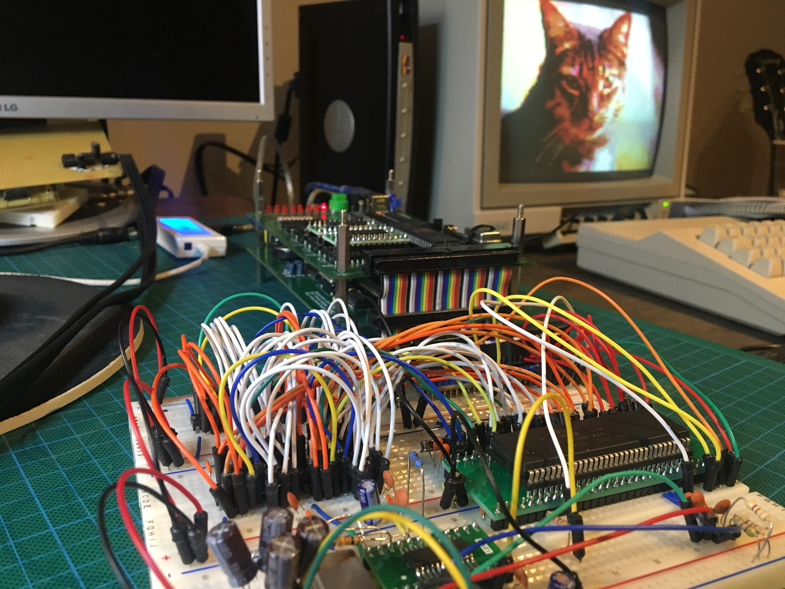
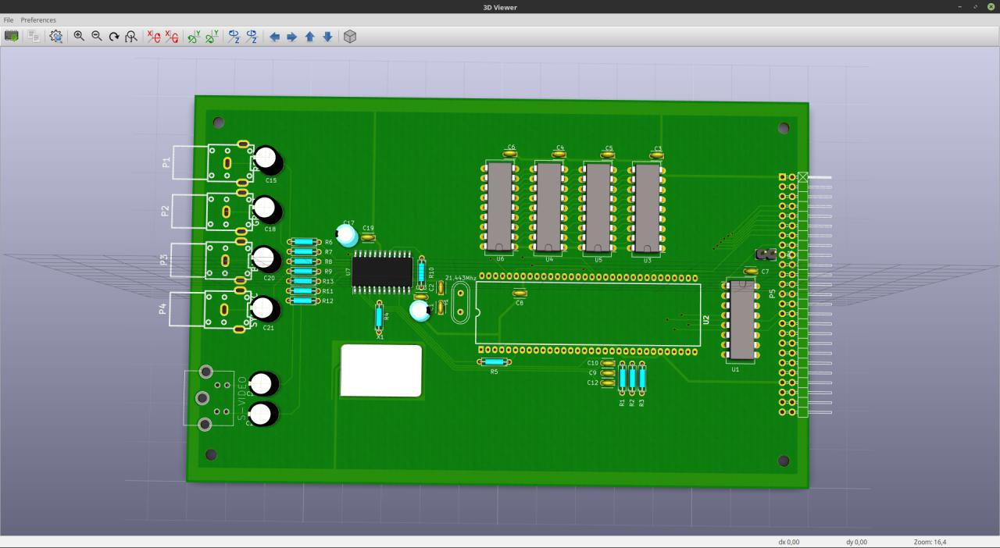

Es ist soweit, der erste Prototyp auf Platine von unserem neuen V9958-Videoboard ist fertig layoutet, und die Platinen warten beim Fertiger auf ihren Versand.

Der Steckbrettaufbau vom [letzten Post](http://steckschwein.de/2017/12/09/es-wird-wieder-gesteckt/) wurde auf 128k erweitert. Dazu ist einfach eine 2. Bank von 2 Stück 64k x 4 DRAMS dazugebaut worden. Damit entspricht der Aufbau unserem Schaltplan, und dieser ist damit getestet.

Unsere Timing-Probleme führen wir auf zu kurze Delays bei Registerzugriffen, ein Softwareproblem also, zurück. Das Businterface als solches ist durchaus sauber, und wir haben es genauso gelassen wie beim TMS9929. Einziger Unterschied ist, dass /CSW und /CSR nicht mehr mit einem 7400 erzeugt werden, sondern mit einem 74139. Damit sparen wir uns später einen IC, wenn wir aus dem Videoboard ein kombiniertes Video- und Soundboard machen, indem wir den OPL2-Chip noch dazupacken. Aber wir greifen vor.

Das neue V9958-Board markiert auch eine Veränderung in unserer Vorgehensweise. Bislang haben wir Neuerungen immer komplett ausdesigned auf dem Steckbrett aufgebaut, und erst ganz am Schluss Platinen fertigen lassen, haben wir hier bewusst erst nur die Basisversion layoutet und direkt als Platinen fertigen lassen. Die günstigen Preise der diversen Platinenfertiger machens möglich, und wir verbringen weniger Zeit mit nervtötenden, wackligen Steckbrettaufbauten, und können uns auch langwierige und fehlerträchtige Aufbauten auf Lochrasterplatine sparen. Als angenehmen Nebeneffekt haben wir zwingend einen Schaltplan für jeden Schritt erstellt und haben somit alles lückenlos dokumentiert. Wir rechnen mit noch mindestens 2 Revisionen des Boards. Nämlich eine Reduktion der DRAM-Bestückung auf einen einzigen 16bit-Baustein, und zum Schluss Hinzufügen des Soundchips, sodass das Steckschwein in Zukunft nur noch aus 3 Platinen besteht. Jedenfalls bis wir uns dann an den Einplatiner wagen.

\[caption id="attachment\_990" align="alignnone" width="4032"\] Der Steckbrettaufbau mit 128k. Für das Bild im Hintergrund werden trotzdem nur 16k verwendet.\[/caption\]

\[caption id="attachment\_991" align="alignnone" width="1280"\] 3D-Rendering der neuen Platine\[/caption\]
