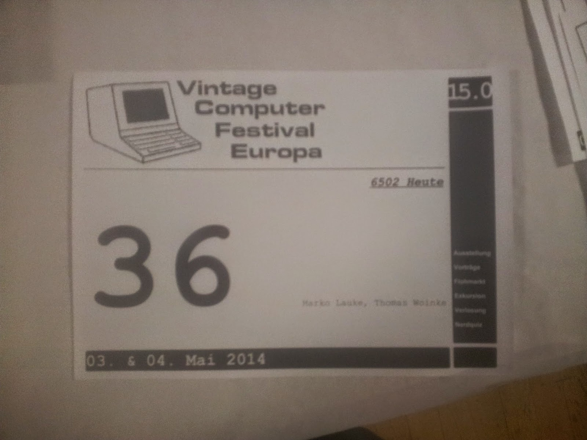
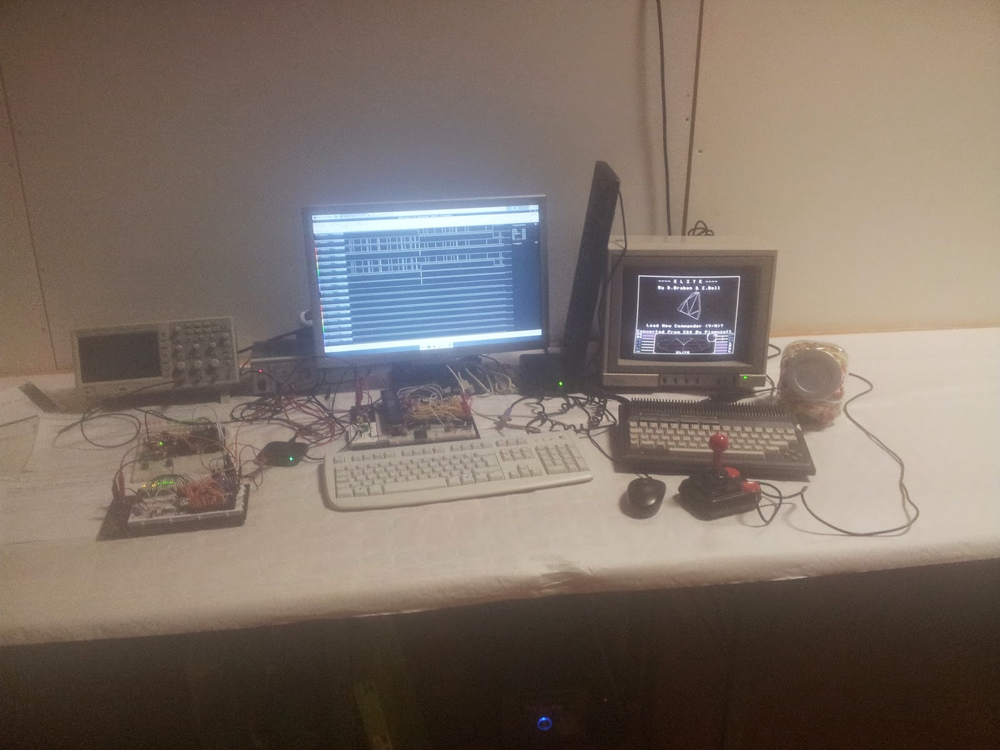

Das [VCFe 15](http://www.vcfe.org/D/) ist zu Ende, wo eine größere Öffentlichkeit unsere Steckschweine und Experimente live in Augenschein nehmen konnte, und wo wir am Sonntag Mittag auch einen kleinen Vortrag zu Entstehung der Idee, des Steckschweins und Problemen halten durften.

Wer uns verpasst hat, findet zumindest hier [die Folien](https://drive.google.com/file/d/0B82yoNWUtYziaHJscW9sVjVpNVk/edit?usp=sharing).

Wir sind immer noch überwältigt von all der positiven Resonanz, die wir erfahren haben. Insgeheim hatten wir eher damit gerechnet, dass unsere Basteleien von den Cracks eher belächelt würden, aber das Gegenteil war der Fall. So viel konstruktive Vorschläge, fachliche Unterstützung und sogar Sachspenden - damit haben wir nicht gerechnet und wir freuen uns tierisch! Vielen Dank an alle!

 

 

