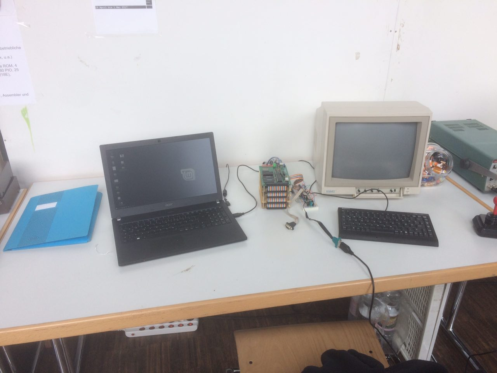

Kein VCFe ohne einen resümmierenden Post-VCFe-Post von uns.

Vorweg: Der neue Veranstaltungsort im Kulturzentrum Trudering ist hervorragend. Eine moderne Veranstaltungshalle, mehr Platz als in der alten ESV-Turnhalle, großzügiger Foyerbereich und ein deutlich größerer Vortragsraum. Die Nahrungsversorgung bestreitet im Kulturzentrum Trudering das integrierte indische Restaurant "Taj", welches ebenso überzeugen konnte. Alles in allem ein großer Gewinn und allen Anzeichen nach wird das nächste VCFe auch wieder dort stattfinden.

 Das Steckschwein auf dem VCFe 18.0

Auch das Interesse am Steckschwein erstaunt und erfreut immer wieder. Dieses Jahr ging es in erster Linie darum, mit EhBasic ein lauffähiges BASIC auf dem Steckschwein nebst einiger Beispielprogramme aus  "101 BASIC Computer Games" zu zeigen. Weiterhin haben wir mit Unterstützung von Carsten Strotmann versucht, VolksForth auf dem Steckschwein zum Laufen zu kriegen, um endlich mal am Ultimate Benchmark teilnehmen zu können. Leider hat sich das Steckschwein hier auch als stark Forth-resistent erwiesen, wie das auch schon bei unseren Versuchen mit FIG-Forth der Fall war. Aber wir bleiben dran.

Die Herren mit den Arcade-Automaten indessen haben merklich gefehlt. Für jüngeres Publikum gab es so nur wenig Daddelmöglichkeiten, weswegen das Steckschwein zeitweilig als Zockmaschine aushelfen durfte.

Alles in allem ist eine tolle Veranstaltung in einer neuen tollen Halle noch toller geworden und wir freuen uns aufs VCFe 19.0.
