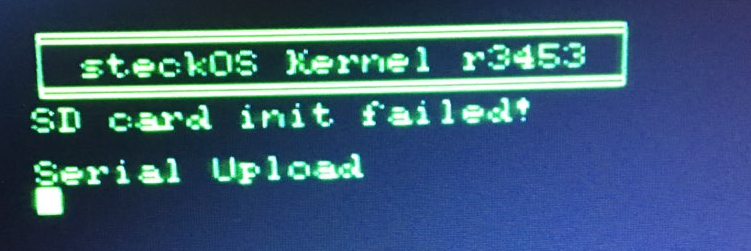

Frank van den Hoef, who is adapting the Steckschwein SPI & FAT32 code for his tiny65 machine made me aware of a classic mistake for a 6502 assembly coder to make. Namely in our sdcard driver, when waiting for the "proper" response from the card (which should have bit 7 cleared). The routine handling this looked like this:

1  sd\_cmd\_response\_wait:
2 	ldy #sd\_cmd\_response\_retries
3 @l:	dey
4         beq sd\_block\_cmd\_timeout ; y already 0? then invalid response or timeout
5         jsr spi\_r\_byte
6         bit #80	; bit 7 clear
7         bne @l  ; no, next byte
8         cmp #$00 ; got cmd response, check if $00 to set z flag accordingly
9         rts
10 sd\_block\_cmd\_timeout:
11        debug "sd\_block\_cmd\_timeout"
12        lda #$1f ; make up error code distinct from possible sd card responses to mark timeout
13        rts

Classic. Obviously, line 6 should read:

          bit #$80 ; bit 7 clear

With that fixed, the sd card init routine now fails, which is odd since we fixed something that was obviously broken.

Ok, now what? Enabling Marko's mighty debugging macros, it becomes apparent that the sd card init fails right after sending CMD0 to the card. This command is the first command of the init sequence and is supposed to put the card into "idle mode". Which the card confirms with an answer of $01. Which is what the init code is expecting, and not getting. Instead, we get $3F, which does not make a lot of sense.

But why did it work before the fix? Assuming that the card did not change it's behaviour at the same time I fixed the code, let's check what actually happened. Before the fix, we were ANDing $3F with 80:

00111111 $3f
01010000 80 (no $, decimal)

In this case, the BNE after the BIT #80 would take the branch to @l, causing the next byte being read, until finally the card responds with $01:

00000001 $01
01010000 80 (no $, decimal)

Now the BNE does not take the branch, and the routine exits.

Now, with the fixed code,  ANDing $3F with **$**80, to check if bit 7 is clear, which it is:

00111111 $3F
10000000 $80

Alright, exit the loop and return $3f as response of the card. Which isn't $01, so init failed.

At this point, I have no explanation for the card responding $3F. I assume that the card might be not ready to process commands at this point, so I added code to repeat sending CMD0 until we get $01 or we run out of retries.
