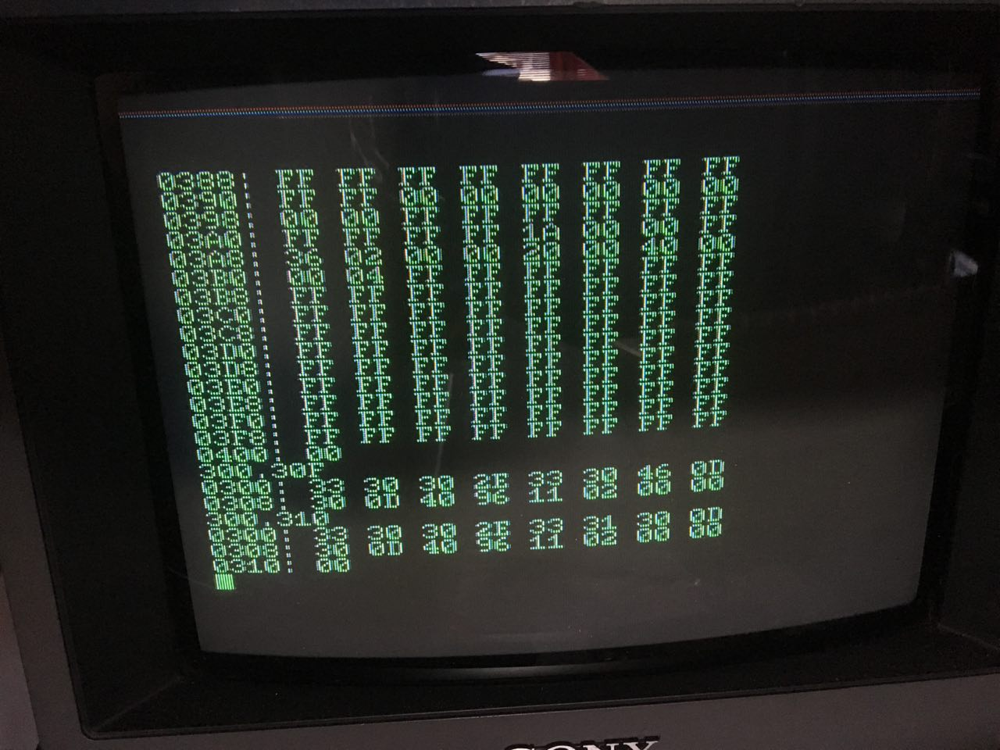

The [woz monitor, also known as WOZMON](https://www.sbprojects.net/projects/apple1/wozmon.php), is a pretty simple memory monitor and was the system software located in the 256 byte PROM on the Apple I. Wozmon is used to inspect and modify memory contents or to execute programs already located in memory. Steve Wozniak managed to squeeze all that functionality into 256 bytes. That's right, bytes. Not megabytes, not kilobytes. Bytes.

We already had attempted to get wozmon ported to our Steckschwein, but we did not succeed so far. That might have been because the wozmon-code is a little bit hard to read and makes use of some Apple I specific things, which we did not know they were, since we do not have any expertise about the Apple I.

Fortunately, we got asked by [Neil Franklin](http://neil.franklin.ch) to proof-read his in-depth [article about the Apple I and wozmon](http://neil.franklin.ch/Info_Texts/Apple_1_Hardware_und_Software.html), which provided us with the missing background knowledge. So, as a proof of correctness and helpfulness of his article, it was time for a new porting attempt. As it turned out, there had to be 2 bigger changes, one while a char is input, and one while a char is output, and a few smaller but important considerations.

We started off using [Jeff Tranter's Version](https://github.com/jefftranter/6502/tree/master/asm/wozmon), because Jeff saved us some grunt work by having adapted the code to ca65 syntax.

So here is our Version of wozmon adapted to run on top of SteckOS in all it's glory:

;  The WOZ Monitor for the Apple 1
;  Written by Steve Wozniak in 1976

Credit where credit is due!

.include "common.inc"
.include "../kernel/kernel.inc"
.include "../kernel/kernel\_jumptable.inc"
.include "appstart.inc"

appstart $1000

Our Standard SteckOS includes. The appstart macro takes care of creating a commodore style file "header" with the load address in the first 2 bytes of the file.

; Page 0 Variables
XAML            = $24           ;  Last "opened" location Low
XAMH            = $25           ;  Last "opened" location High
STL             = $26           ;  Store address Low
STH             = $27           ;  Store address High
L               = $28           ;  Hex value parsing Low
H               = $29           ;  Hex value parsing High
YSAV            = $2A           ;  Used to see if hex value is given
MODE            = $2B           ;  $00=XAM, $7F=STOR, $AE=BLOCK XAM

Nothing changed here.

; Other Variables
IN              = $0300         ;  Input buffer to $027F
; KBD             = $D010         ;  PIA.A keyboard input
; KBDCR           = $D011         ;  PIA.A keyboard control register
; DSP             = $D012         ;  PIA.B display output register
; DSPCR           = $D013         ;  PIA.B display control register

               ; .org $FF00
               ; .export RESET

We need to put the input buffer from $027F to somewhere else, because $027F collides with our I/O area. $0300 should be fine. We do not use a PIA for i/o, so we can get rid of those labels. Also, the start address is already defined above, and we won't need to export the RESET label.

RESET:          CLD             ; Clear decimal arithmetic mode.
                CLI
                LDY #$7F        ; Mask for DSP data direction register.
                ; STY DSP         ; Set it up.
                LDA #$A7        ; KBD and DSP control register mask.
                ; STA KBDCR       ; Enable interrupts, set CA1, CB1, for
                ; STA DSPCR       ; positive edge sense/output mode.

No need to initialize the PIA chip which we don't have, but we still need to initialize the A and Y registers.

NOTCR:          ; CMP #'\_'    ; "\_"?
                CMP #$08 + $80
                BEQ BACKSPACE   ; Yes.

Backspace is $08 on the Steckschwein, not "\_".

                CMP #$9B        ; ESC?
                BEQ ESCAPE      ; Yes.
                INY             ; Advance text index.
                BPL NEXTCHAR    ; Auto ESC if > 127.
ESCAPE:         LDA #'\\' + $80   ; "\\".
                JSR ECHO        ; Output it.
GETLINE:        LDA #$8A        ; CR.
                JSR ECHO        ; Output it.
                LDY #$01        ; Initialize text index.
BACKSPACE:      DEY             ; Back up text index.
                BMI GETLINE     ; Beyond start of line, reinitialize.
NEXTCHAR:
                ; LDA KBDCR       ; Key ready?
                ; BPL NEXTCHAR    ; Loop until ready.
                ; LDA KBD         ; Load character. B7 should be ‘1’.
                keyin
                toupper
                ORA #$80

Here is our first major code change. Keyboard input is handled using SteckOS means. Then we convert the received character to uppercase, since the Apple I uses uppercase only, hence wozmon does not handle lowercase. Also, and most important, the Apple I keyboard generated ASCII with bit 7 set to "1". We need to emulate that. With these modifications, the bulk of the code can remain as is.

                STA IN,Y        ; Add to text buffer.
                JSR ECHO        ; Display character.
                CMP #$8D        ; CR?
                BNE NOTCR       ; No.
                LDY #$FF        ; Reset text index.
                LDA #$00        ; For XAM mode.
                TAX             ; 0->X.
SETSTOR:        ASL             ; Leaves $7B if setting STOR mode.
SETMODE:        STA MODE        ; $00=XAM $7B=STOR $AE=BLOK XAM
BLSKIP:         INY             ; Advance text index.
NEXTITEM:       LDA IN,Y        ; Get character.
                CMP #$8D        ; CR?
                BEQ GETLINE     ; Yes, done this line.
                CMP #'.' + $80    ; "."?
                BCC BLSKIP      ; Skip delimiter.
                BEQ SETMODE     ; Yes. Set STOR mode.
                CMP #':' + $80   ; ":"?
                BEQ SETSTOR     ; Yes. Set STOR mode.
                CMP #'R' + $80   ; "R"?
                BEQ RUN         ; Yes. Run user program.
                STX L           ; $00-> L.
                STX H           ; and H.
                STY YSAV        ; Save Y for comparison.
NEXTHEX:        LDA IN,Y        ; Get character for hex test.
                EOR #$B0        ; Map digits to $0-9.
                CMP #$0A        ; Digit?
                BCC DIG         ; Yes.
                ADC #$88        ; Map letter "A"-"F" to $FA-FF.
                CMP #$FA        ; Hex letter?
                BCC NOTHEX      ; No, character not hex.
DIG:            ASL
                ASL             ; Hex digit to MSD of A.
                ASL
                ASL
                LDX #$04        ; Shift count.
HEXSHIFT:       ASL             ; Hex digit left, MSB to carry.
                ROL L           ; Rotate into LSD.
                ROL H           ;  Rotate into MSD’s.
                DEX             ; Done 4 shifts?
                BNE HEXSHIFT    ; No, loop.
                INY             ; Advance text index.
                BNE NEXTHEX     ; Always taken. Check next char for hex.
NOTHEX:         CPY YSAV        ; Check if L, H empty (no hex digits).
                BEQ ESCAPE      ; Yes, generate ESC sequence.
                BIT MODE        ; Test MODE byte.
                BVC NOTSTOR     ;  B6=0 STOR 1 for XAM & BLOCK XAM
                LDA L           ; LSD’s of hex data.
                STA (STL,X)     ; Store at current ‘store index’.
                INC STL         ; Increment store index.
                BNE NEXTITEM    ; Get next item. (no carry).
                INC STH         ; Add carry to ‘store index’ high order.
TONEXTITEM:     JMP NEXTITEM    ; Get next command item.
RUN:            JMP (XAML)      ; Run at current XAM index.
NOTSTOR:        BMI XAMNEXT     ; B7=0 for XAM, 1 for BLOCK XAM.
LDX #$02        ; Byte count.
SETADR:         LDA L-1,X       ; Copy hex data to
                STA STL-1,X     ; ‘store index’.
                STA XAML-1,X    ; And to ‘XAM index’.
                DEX             ; Next of 2 bytes.
                BNE SETADR      ; Loop unless X=0.
NXTPRNT:        BNE PRDATA      ; NE means no address to print.
                LDA #$8A        ; CR.
                JSR ECHO        ; Output it.
                LDA XAMH        ; ‘Examine index’ high-order byte.
                JSR PRBYTE      ; Output it in hex format.
                LDA XAML        ; Low-order ‘examine index’ byte.
                JSR PRBYTE      ; Output it in hex format.
                LDA #':' + $80  ; ":".
JSR ECHO        ; Output it.
PRDATA:         LDA #$A0        ; Blank.
                JSR ECHO        ; Output it.
                LDA (XAML,X)    ; Get data byte at ‘examine index’.
                JSR PRBYTE      ; Output it in hex format.
XAMNEXT:        STX MODE        ; 0->MODE (XAM mode).
                LDA XAML
                CMP L           ; Compare ‘examine index’ to hex data.
                LDA XAMH
                SBC H
BCS TONEXTITEM  ; Not less, so no more data to output.
                INC XAML
BNE MOD8CHK     ; Increment ‘examine index’.
                INC XAMH
MOD8CHK:        LDA XAML        ; Check low-order ‘examine index’ byte
                AND #$07        ; For MOD 8=0
BPL NXTPRNT     ; Always taken.
PRBYTE:         PHA             ; Save A for LSD.
                LSR
                LSR
                LSR             ; MSD to LSD position.
                LSR
JSR PRHEX       ; Output hex digit.
                PLA             ; Restore A.
PRHEX:          AND #$0F        ; Mask LSD for hex print.
                ORA #'0' + $80  ; Add "0".
                CMP #$BA        ; Digit?
                BCC ECHO        ; Yes, output it.
                ADC #$06        ; Add offset for letter.
ECHO:
                ; BIT DSP         ; bit (B7) cleared yet?
                ; BMI ECHO        ; No, wait for display.
                ; STA DSP         ; Output character. Sets DA.
                pha
                and #$7F
                jsr krn\_chrout
                pla
                RTS             ; Return.

Second important change. We got rid of the Apple I specific routine to output characters and use the chrout-routine of the SteckOS-kernel. But in order not to output garbage, we need to unset bit 7. Since all comparisons afterwards still rely on bit 7 being set, we save the A register to the stack and restore it afterwards. A faster way would be to just set bit 7 again by doing a ORA #$80 before the RTS, but what the heck.

; BRK             ; unused
; BRK             ; unused

We don't need those.

; Interrupt Vectors
; .WORD $0F00     ; NMI
; .WORD RESET     ; RESET
; .WORD $0000 ; BRK/IRQ

We don't need those either since we are not using wozmon as system software. Interrupt handling is still done by the SteckOS kernel.

 

\[caption id="attachment\_1113" align="alignnone" width="1280"\] Tada!\[/caption\]
