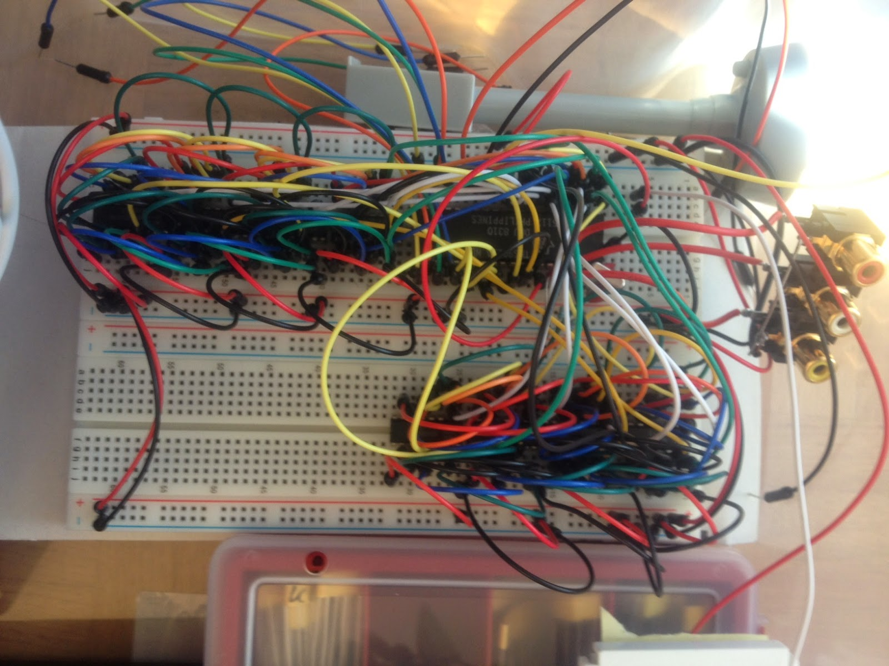

... und zwar auf einem Bildschirm! Aber wie stellt man sowas an?! Nun, wir schauen uns um, was Ende der 70-er bzw. Anfang der 80-er Jahre Stand der Technik war und was sich mit überschaubarem Aufwand an eine 6502 CPU "anschließen" lässt. Die Auswahl ist leider überschaubar, denn es sollte irgendwas in DIP maximal noch SDIP sein und dazu noch irgendwie lieferbar - "new old stock".

Wir fanden die TMS9918/28/29-Serie und einige Nachfolger wie den TMS9938/58. Für's erste sollte es ein TMS9929 sein, weil der tatächlich noch zu beschaffen ist und dazu auch noch im DIP-Gehäuse daherkommt. Der -29 ist für den europäischen Markt gebaut worden, um diese an PAL-Fernsehgeräte anschließen zu können. Hier eine kleiner Auszug  der technischen Fähigkeiten, die im [Jahre 1980](http://msx.hansotten.com/uploads/ffiles/1980%20TMS9918%20Advertisement.jpg) wahrscheinlich gigantisch wirkten.

• 256x192 resolution on TV screen • 15 unique colors plus transparent • General 8-bit bidirectional interface to Central Processor Unit (CPU) • Direct wiring to 4K, 8K, or 16K dynamic RAM memories • Automatic and transparent refresh of dynamic RAMs • Unique planar representation for 3D simulation • Standard 40-pin package • Color difference outputs allow RGB drive - TMS992SA/9929A

Ok, schauen wir uns mal das [Datenblatt](http://www.bitsavers.org/components/ti/TMS9900/TMS9918A_TMS9928A_TMS9929A_Video_Display_Processors_Data_Manual_Nov82.pdf) an. Aha, oha, soso.... sieht doch gar nicht so schwierig aus. Jetzt brauchen wir noch passende DRAM's da wird's schon schwieriger. Zum Glück hat der Dommas sowas in seiner Bastelkiste, gleich nen ganzen Sack diverser Typen. Glück gehabt.... Im Datenblatt steht TMS4116, in der Bastelkiste finde ich NEC416 die sind exakt baugleich von daher pinkompatibel. Die DRAMs an den VDP zu kleben ist im Datenblatt beschrieben, ich lese mir das ganze bestimmt 50 Mal durch, hab nen Knoten im Kopf und verstehe nicht warum man das damals so kompliziert machen musste... Dazu kommt, dass ich Beschaltung und Funktionsweise von DRAMs das letzte mal vor 14 Jahren gehört habe. Also lese ich mich auch hier nochmal ein.

Für den TMS9929 brauchen wir 8 16K DRAMs, die 1Bit organisiert sind, ebend genau der 4116 Typ oder baugleich. Ich besorge mir also noch ein paar Steckbretterund jede Menge Steckbrettkabel, um das Gestrüpp herzustellen.

<table style="margin-left:auto;margin-right:auto;text-align:center;" cellspacing="0" cellpadding="0" align="center"><tbody><tr><td style="text-align:center;"></td></tr><tr><td style="text-align:center;">TMS9929 und DRAM's</td></tr></tbody></table>

Fertig, ich freu mich, seh zwar noch nix bin aber zuversichtlich...
