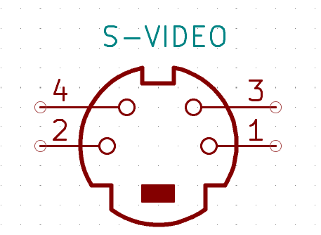
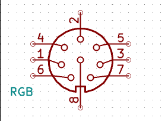

The single board Steckschwein marks several major milestones in the development of our favourite homebrew computer. The goal has alwas been to integrate the various boards onto one single PCB.

## Specifications
- [65c02-CPU](https://en.wikipedia.org/wiki/MOS_Technology_6502) @ 10MHz
- 512k RAM
- 32k ROM
- Video chip [V9958](https://en.wikipedia.org/wiki/Yamaha_V9958)
  - Video RAM: 128 KB + 64 KB of expanded VRAM (optional)
  - Text modes:
    - 80 x 24 
    - 32 x 24
  - Graphics Resolutions: 
    - 512 x 212 (4 or 16 colors out of 512) 
    - 256 x 212 (16, 256, 12499 or 19268 colors)
  - Sprites: 32 (max 8 per horizontal line)
  - Scroll registers

- Sound chip [YM3812](https://en.wikipedia.org/wiki/Yamaha_YM3812) (OPL2)
  - 9 voices
  - 2 oscillators (operators) per voice
  - 4 waveforms (sine, half-sine, absolute sine, pseudo-sawtooth) per operator

- rs232 via [UART 16550](https://en.wikipedia.org/wiki/16550_UART)
- SPI used as main peripheral bus for:
    - sd-card based mass storage
    - PS/2-peripheral controller (keyboard, mouse) (ATmega8)
    - RTC ([Maxim DS1306](http://www.maximintegrated.com/en/products/digital/real-time-clocks/DS1306.html))

## Memory Map

For a detailed description on how our banking scheme works, see [this post](/post/512k-ought-to-be-enough-for-anybody/) and also the [slides from our talk at CVFe 22.0](/pdf/vcfe22.pdf).

512k RAM organized in pages 16k each

|Slot|Start|End|
|:---|:---|:---|
|0|$0000|$3fff|
|1|$4000|$7fff|
|2|$8000|$bfff|
|3|$c000|$ffff|

Slot 0 is special, since it also contains the zero page, the stack (as given by the 65C02's design) and also the IO-area. 

| Address | Description |  
| --- | --- | 
| $0000-$00ff | Zeropage | 
| $0100-$01ff | Stack |
| $0200-$02ff | IO-Area | 
| $0300-$3fff | RAM |

The IO-area consists of 16 byte areas for the peripheral devices to be mapped in and also 4 internal registers to control the memory mapping. 

| Address | Device |
| --- | --- |
| $0200 | UART |
| $0210 | VIA |
| $0220 | VDP |
| $0230 | banking register slot 0|
| $0231 | banking register slot 1|
| $0232 | banking register slot 2|
| $0233 | banking register slot 3|
| $0240 | OPL |
| $0250 | Expansion Slot 0 |
| $0260 | Expansion Slot 1 |
| $0270 | reserved |

The four "banking registers" are used to select the memory page to be mapped into which slot. Writing 0 into the banking register for slot 0 ($0230) will map the first 16k of the 512k into slot 0.

## Pinouts
Connectors on the Steckschwein are more or less standard like PS/2, RS232, s-video. RGB is "inspired" by the NeoGeo Console, who used a standard 8pin DIN-Type connector for RGB, Composite Video and Audio. \
User Port and the espansion slots have custom pinouts, of course.

### S-Video

|Pin|Description|
|---|-----------|
|1  |Luminance GND|
|2  |Chrominance GND|
|3  |Luminance|
|4  |Chrominance|
 
### RGB

|Pin|Description|
|---|-----------|
|1  |Audio|
|2  |GND|
|3  |Composite / Sync|
|4  |5V|
|5  |Green|
|6  |Red|
|7  |Composite / Sync|
|8  |Blue|
### Expansion Slots

|Pin|Description|
|---|-----------|
|1|D0|
|2|A9|
|3|D1|
|4|A1|
|5|D2|
|6|A2|
|7|D3|
|8|A3|
|9|D4|
|10|RW|
|11|D5|
|12|WE|
|13|D6|
|14|OE|
|15|D7|
|16|CS|
|17|IRQ|
|18|NMI|
|19|RDY|
|20|PHI2|
|21|RESET|
|22|RESET_TRIG|
|23|5V|
|24|GND|

### User Port

|Pin|Description|
|---|-----------|
|1|VIA PA0|
|2|VIA PA1|
|3|VIA PA2|
|4|VIA PA3|
|5|VIA PA4|
|6|VIA PA5|
|7|VIA PA6|
|8|VIA PA7|
|9|GND|
|10|5V|
|11|N.C. (key)|
|12|N.C. (key)|
|13|RESET|
|14|IRQ|
|15|VIA CA2|
|16|VIA CA1|

### JTAG
This connector is used to program the CPLD

|Pin|Description|
|---|-----------|
|1|TMS|
|2|TDI|
|3|TDO|
|4|TCK|
|5|GND|
|6|5V|

