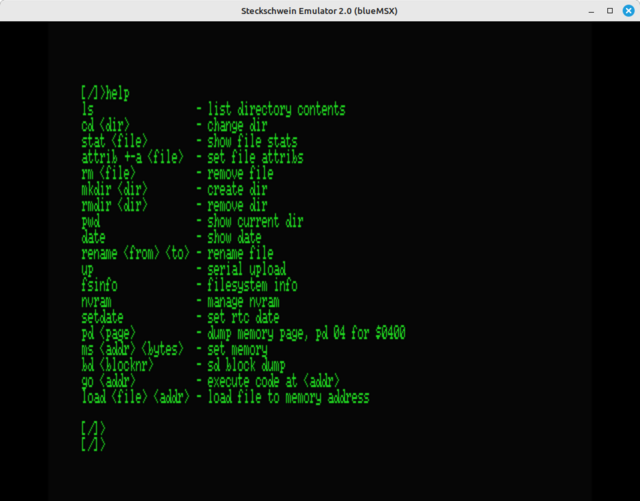
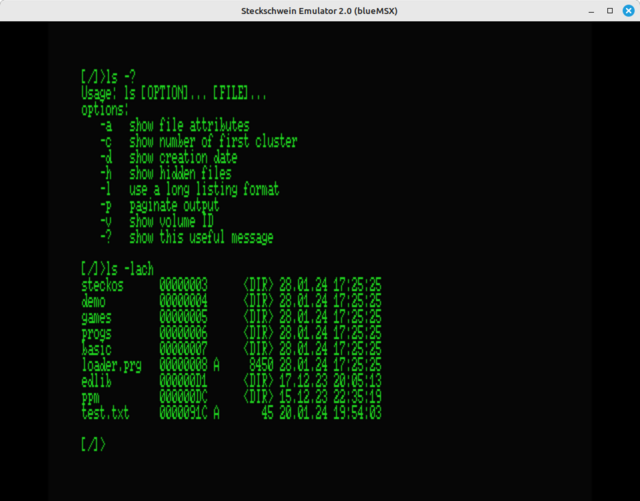

# BIOS

At initial boot time, the ROM bank containing the BIOS is banked in at top memory. The BIOS provides the RESET vector, and initializes the hardware, such as the UART and the video chip. 
Then, it checks for an SD card, tries to mount it and open the OS loader executable (usually LOADER.PRG). If this is successful, the OS loader is executed and loads the actual operating system "steckOS".
On failure, the BIOS expects a binary uploaded via XMODEM. 

# steckOS

The operating system loader (LOADER.PRG) contains the actual steckOS kernel, and the startup code that loads the OS and starts up the kernel. The OS loader as well as any executable in steckOS are in PRG format with the load address in the first two bytes as known from Commodore computers.

## kernel

After having been loaded by the OS loader, the kernel initializes the hardware (again), mounts the SD card and tries to find the shell executable, which it then executes.
The steckOS kernel provides basic interrupt handling, text display routines for the VDP and a jumptable with kernel calls.

### Jumptable

#### basic kernel stuff

|Label       |Purpose                              |
|:-----------|:------------------------------------|
|krn_getkey  |fetch character from keyboard buffer |
|krn_chrout  |output character to screen           |
|krn_upload  |jump to xmodem upload routine        |
|krn_execv   |load PRG file and execute            |

#### filesystem stuff

|Label             |Purpose                              |
|:-----------------|:------------------------------------|
|krn_mount         |mount FAT32 filesystem               |
|krn_open          |open file                            |
|krn_chdir         |change into directory                |
|krn_unlink        |delete file                          |
|krn_rmdir         |delete directory                     |
|krn_mkdir         |create directory                     |
|krn_close         |close file                           |
|krn_close_all     |close all open files                 |
|krn_fread         |read entire file                     | 
|krn_fread_byte    |read byte from file                  |
|krn_write         |write file                           |
|krn_find_first    |find first dir entry for pattern     |
|krn_find_next     |find next dir entry for pattern      |
|krn_getcwd        |get current directory                |

#### display stuff

|Label             |Purpose                              |
|:-----------------|:------------------------------------|
|krn_textui_init   |                                     |
|krn_textui_enable ||
|krn_textui_disable|| 
|krn_textui_crsxy  |set cursor to position x/y           |
|krn_textui_update_crs_ptr| |
|krn_textui_setmode|set display mode |
|krn_textui_crs_onoff|cursor on/off|

#### sd card stuff

|Label             |Purpose                              |
|:-----------------|:------------------------------------|
|krn_sd_write_block|write block to SD card|
|krn_sd_read_block |read block from SD card|

#### spi stuff
|Label                 |Purpose                              |
|:---------------------|:------------------------------------|
|krn_spi_select_device |select SPI device|
|krn_spi_deselect      |deselect all SPI devices|
|krn_spi_rw_byte       |read/write byte|
|krn_spi_r_byte        |read byte|

#### serial stuff
|Label                 |Purpose                              |
|:---------------------|:------------------------------------|
|krn_uart_tx           |write byte over serial|
|krn_uart_rx           |read byte over serial|

## library

Hardware interfacing code and utility routines both used by BIOS and steckOS are located in the library. Examples are utility routines to convert binary to ASCII decimal or hexadecimal, but also the SD card driver and FAT32 file system implementation.

## shell
So what can you do with steckOS? The short answer is - not much. steckOS's primary goal was to be able to navigate the file system and start programs.

To be able to do this, the first thing needed was a command line interface. The steckShell is a simple REPL interface roughly modeled after the Unix sh shell. The shell also provides commands to inspect and modify memory contents.

### internal commands

The following commands are internally build into the shell executable.

#### pwd, mkdir, rmdir, rm, cls

These commands do what their Unix/Linux/DOS counterparts do.

#### up

up jumps to the kernel xmodem upload routine and expects an executable in PRG format to be sent via xmodem.

#### pd

pd (page dump) shows a memory page (256 bytes) or a range of memory pages in hexdump format.

#### ms

ms (memory set) sets the content of a memory address plus the following bytes

#### go

go starts executing code at the given memory location

#### load

load is used to load the contents of a file to a give memory location

#### save

save is used to save a memory area (from address, to address) to a file

#### bd

bd (block dump) loads a block (512 bytes) from SD card and displays it's contents like pd

### external commands and tools

Every other command is searched for in a hard coded "PATH" and executed. Commands and tools are mostly named after their Unix / DOS counterparts. 

#### help

The "help"-command lists the most important commands.

#### ll

Like it's Unix/Linux counterpart, ll shows the content of the current directory or the directory specified as command line argument. The output resembles that of DOS's dir command.

#### ls

Displays directory contents, like a mix of the DOS "dir" command and the "ls" command in Unix/Linux.

#### stat

Much like the Unix/Linux stat command, stat shows meta information about a file or directory, including file attributes. There is also an attrib command to set/unset attributes. 

#### attrib

Much like it's DOS counterpart, attrib is used to set/unset certain FAT attributes such as the hidden bit.

#### fsinfo

fsinfo lists some information about the currently mounted FAT32 file system.

#### nvram

nvram shows and/or modifies the contents of the RTCs NVRAM. The NVRAM is used to store the OS loader filename, UART settings like baud rate and line parameters, and the keyboard delay and repeat rate. nvram is written in C.

#### date and setdate

date and setdate are used to display or set the RTC time. date and setdate are written in C.

#### banner

A version of the Unix SYS V banner command taken from [here](https://github.com/uffejakobsen/sysvbanner/blob/master/banner.c). One of the few tools written in C. The source compiled with cc65 without modifications. We changed some int variables to unisigned char anyway to fit our 8bit CPU.

#### wozmon

Steve Wozniak's legendary memory monitor fitting in one page (256 bytes). The effort of adapting it to steckOS is documented in [this blog post](/post/wozmon-a-memory-monitor-in-256-bytes/)

## Programming languages

An 8bit computer is nothing without period correct interpreter languages like BASIC and Forth.

### EhBasic

EhBasic is a quite common BASIC interpreter among homebrew enthusiasts because of it's easy portability. Our version is based on the [65c02 version by forum.6502.org user floobydust](http://forum.6502.org/viewtopic.php?f=5&t=5760). We extended it with a few graphics commands that interface with the V9958's command engine and implemented a [LOAD routine that accepts ASCII source files](/post/ascii_ehbasic/).

### TaliForth2

[TaliForth 2](https://github.com/scotws/TaliForth2) is a subroutine threaded code (STC) implementation of an ANS-based Forth for the 65c02 written by Scot W. Stevenson. 

## Games

A computer is nothing without games, so we had to write/port a few.

### dinosaur

An endless runner, just like the one built-in into the Chrome browser.

### pong

Our pong clone uses the TMS9918's multicolor mode with 64x48 pixels. Yes, those squares are single pixels.

### MicroChess

MicroChess is a chess game, written in 1976 for the MOS/Commodore KIM-1 by Peter Jennings, making the KIM-1 the first affordable chess computer. Our version is based on the [serial line version by Daryl Rictor](http://6502.org/source/games/uchess/uchess.htm) which includes display of a chess board.

## Other neat stuff

### unrclock

An unary clock, nice to look at, useful as screen saver, and like pong another showcase for the 64x48 pixel multicolor mode.