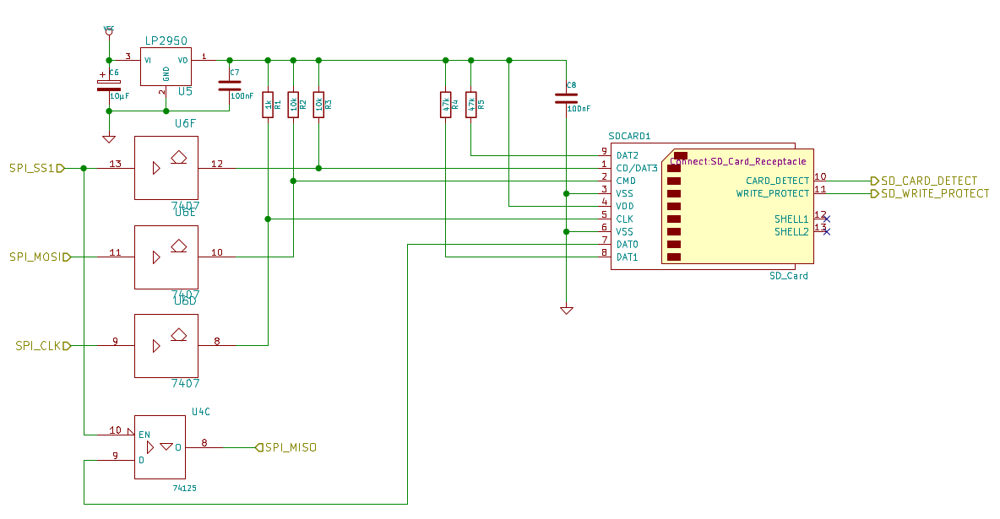
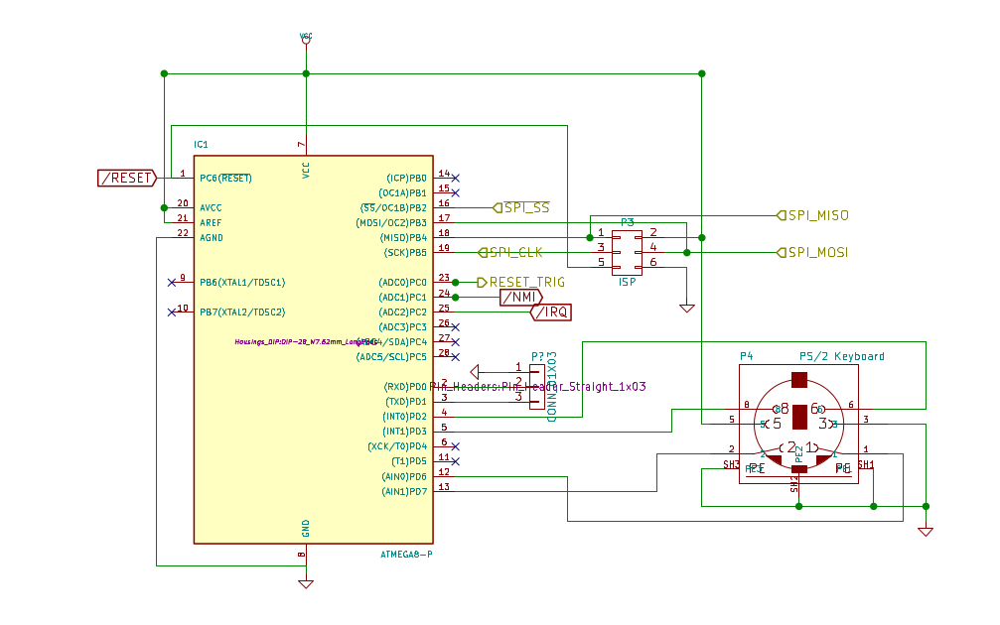
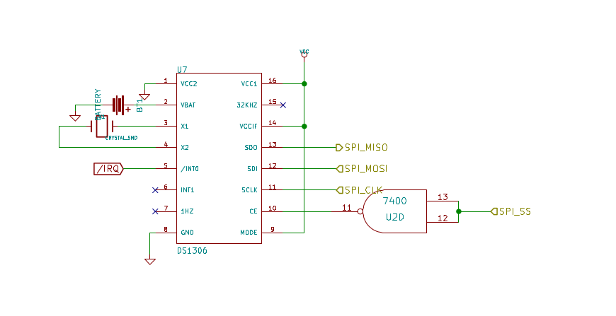

### SD-Card as really cheap and lazy mass storage

Most important device on the Steckschwein using the SPI-Bus and therefore the "killer application", that sold the idea of using SPI to us, is the sd card. The only additional hardware effort was to level shift the signals from and to the sd-card, as it runs on 3.3V while the Steckschwein uses 5V. To accomplish this, the SPI clock, SPI slave select and MOSI are converted using a 74LS07, with it's open collector outputs pulled up to 3.3V. The other direction, MISO, is routed to one of the units of a 74HCT125, whose inputs can deal with 3.3V logic and whose outputs are TTL compliant, hence HCT.

With mass storage implemented as simple as that, why bother fiddling around with floppy disk controllers or IDE drives or stuff like that?

#### ATmega8 used as PS/2 keyboard controller

An ATmega8 is used as PS/2 keyboard and maybe (later) mouse controller. The code running on the ATmega is based on [AVR Application Note 313](http://www.atmel.com/Images/doc1235.pdf) , but without the UART code. Instead, we added code to act as an SPI slave. Also, we implemented a german keyboard layout and support for a few modifier keys that was missing in the original code. Also, special keys or key combinations like SysRq and the three-finger-salute are being handled directly by the keyboard controller to pull the respective signals like NMI or trigger a hardware reset.

**RTC DS1306**

The RTC DS1306 delivers the current time down to second resolution, supports two alarms and also has 96 bytes of battery backed memory, which makes it double as storage for system boot parameters. In fact, we store the name of the file to load at boot time and also the UART parameters there. Main reason to add the RTC was, that a real nice machine of course needs an RTC, but also as a time source to set the proper file creation time and date in our FAT32 implementation.

