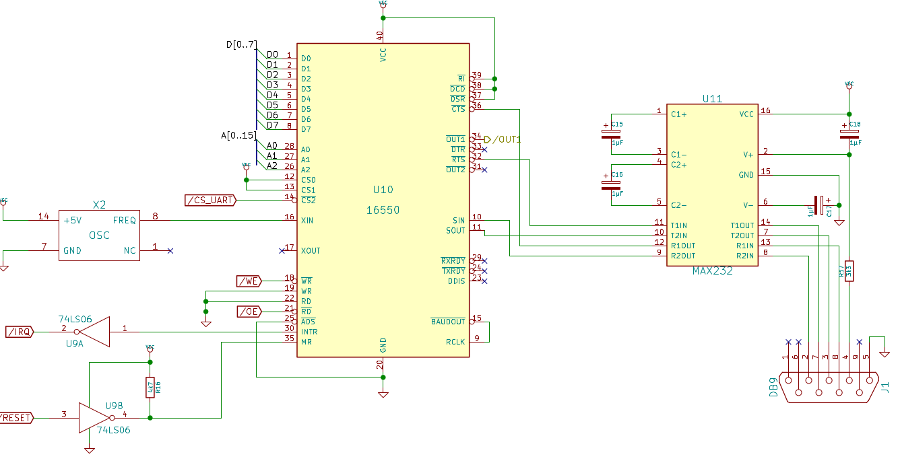

The 16550 UART was the first chip to be attached to the CPU bus that does not have a native 65xx bus interface and hence needed a little more effort. The reset and interrupt signals are active high, while the 6502 needs them to be active low. So reset needed to be inverted, and interrupt is driven through a 74LS06 inverter driver with open collector outputs in order to be able to be wire-ORed to the system interrupt line. Furthermore, there is no combined R/W line, so that signal hat to be split up into /WR and /RD. Here, we just use /OE and /WE which are generated on the CPU board.

