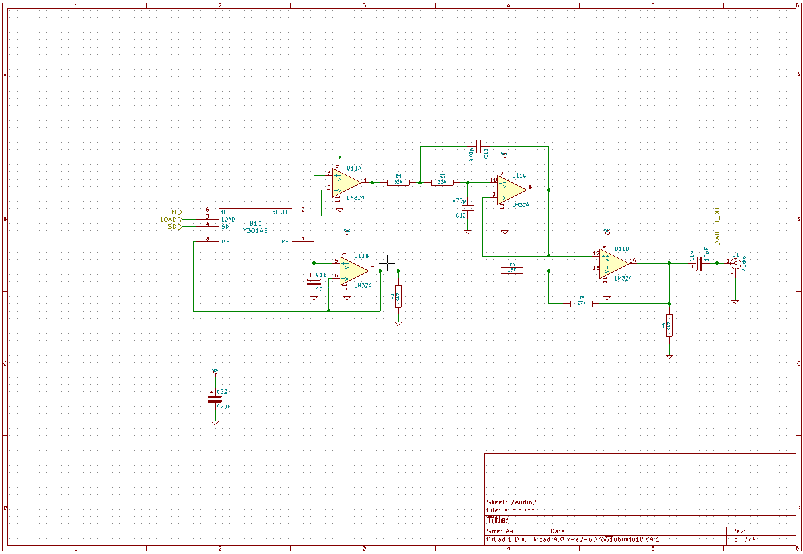
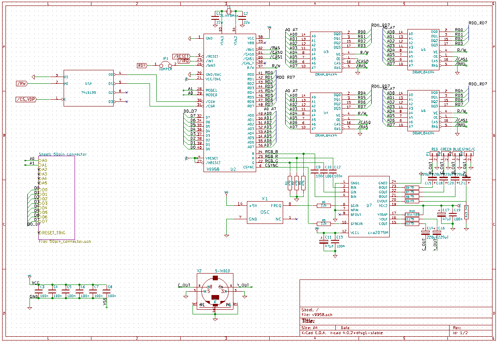
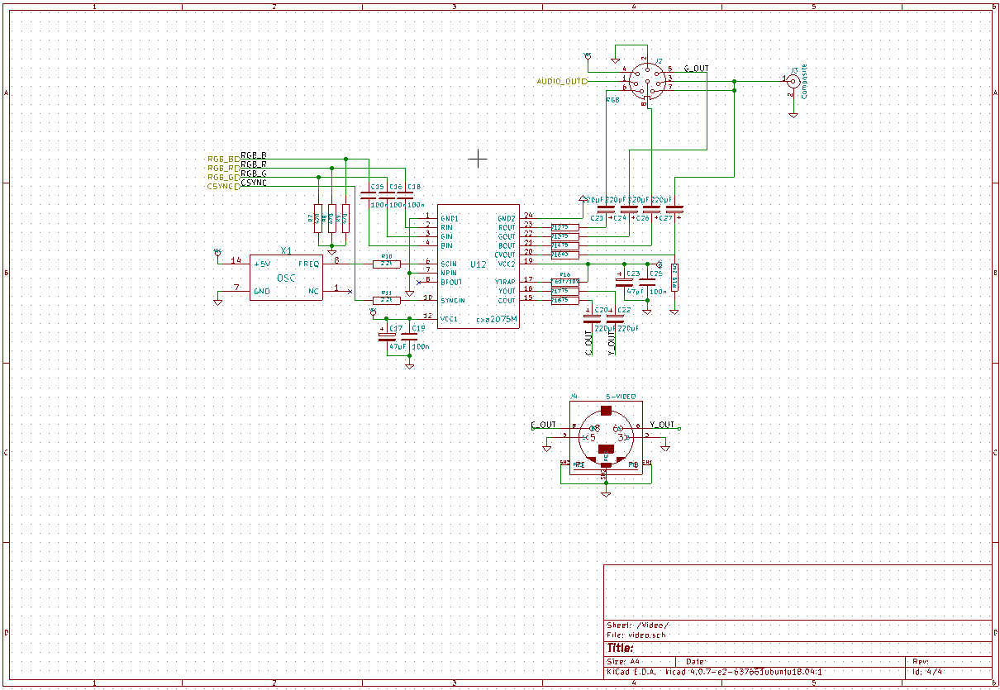

Our current audio/video board is based on the Yamaha V9958. The V9958 is the successor of the V9938, which in turn is the successor to our TMS9929/9918, which has served our project for quite some time. But it is hard to ignore what the V9958 has to offer (80 column text mode to begin with), so we decided to use it as the first major upgrade to the Steckschwein Hardware specs in a couple of years.

Like the [9929 board](http://steckschwein.de/hardware/tms9929-video-display-processor/), the all new, all more powerful video board based on the mighty [Yamaha V9958](https://www.msx.org/wiki/Yamaha_V9958) chip has two parts - the video chip part with the 128k video memory (64k x 4 DRAM this time) and the signal part, using the Sony CXA2075M chip not only as RGB output stage, but also to generate composite video and s-video. This should increase the number of Steckschwein-compatible monitors a big deal. We also now have 128K of video memory, which gives us modes like 256x212 wth 256 colours. Also, we have 64K of "extended RAM", which can be used to keep stuff within access of the video chip.

The current board revision also contains the sound chip, which makes it the audio / video board.

And by thinking sound chip and 8bit, the first thing comes to mind is of course the MOS 6581 SID chip, prominently used in the C64 and hands down the best sound chip from the 8bit era. But the SID has a few drawbacks that would make it difficult to use for the Steckschwein:

1. It’s maximum clock rating is 2MHz. We’re already running at 8MHz, so that’s going to be a problem.
2. While not hard to come by, SID chips aren’t cheap. Prices of about 40 Euros or more per unit are common. And those chips are not NOS, they are most likely pulled from a C64. We do not want to build the Steckschwein out of scavenged parts.

We decided to use the Yamaha [YM3812](https://en.wikipedia.org/wiki/Yamaha_YM3812) chip, which might be better known as OPL2. That’s right, the very chip that was used on early PC sound cards such as AdLib or the first Sound Blaster cards. OPL2 chips are easy to come by, and they are rather cheap.

 

[Schematics as PDF](/v9958.pdf)
