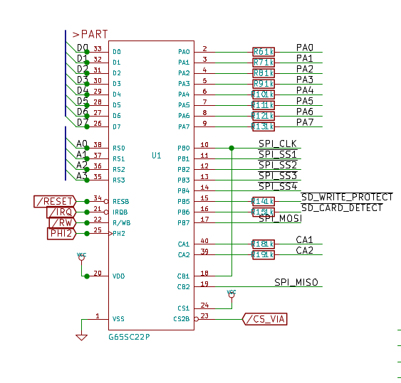

One of the fundamental design decisions when creating the Steckschwein was to use SPI as the main peripheral bus. This way, various different devices can be utilized using a single interface protocol. The main killer feature for using SPI was to be able to use an SD card as mass storage. This gives us mass storage with almost no extra hardware effort, only level conversion is needed between the system (5V) and the card (3.3V).

The most common io device for the 6502 processor is the 6522 VIA (Versatile Interface Adapter). In our case, we are using it among a few other things as as the SPI master. VIA port B is solely dedicated to be used with SPI devices. The direction MISO (Master In, Slave Out) is covered by the internal shift register of the VIA. The VIA pins are used as follows:

<table border="1"><tbody><tr><td>PB0</td><td>SPICLK</td></tr><tr><td>PB1</td><td>SS1 SD-card</td></tr><tr><td>PB2</td><td>SS2 PS/2 keyboard controller (ATmega8)</td></tr><tr><td>PB3</td><td>SS3 RTC (DS1306)</td></tr><tr><td>PB4</td><td>SS4 (unused)</td></tr><tr><td>PB5</td><td>sd card write protect</td></tr><tr><td>PB6</td><td>sd card detect</td></tr><tr><td>PB7</td><td>MOSI</td></tr><tr><td>CB1</td><td>SPICLK (connected to PB0)</td></tr><tr><td>CB2</td><td>MISO</td></tr></tbody></table>

Basically, the process of reading data via SPI only consists of setting the appropriate slave select pin to low and then "wiggling" the PB0 pin as fast as possible, which is determined by how fast the CPU is able to write to the port. This also means that the shift register is used in "Shift In - External CB1 Clock Control (011)"-mode, which is the very mode affected by the infamous [VIA-Bug](http://forum.6502.org/viewtopic.php?t=342#p2310). We did not do anything circuit wise to implement a workaround. We rather rely on the fact, that we create the SPI clock using the processor and hereby have the SPI clock locked to the system clock, so the signal slopes have a fixed delay. This should take care of the bug not to occur. Hopefully.

[Schematic as PDF](https://steckschwein.files.wordpress.com/2018/03/io.pdf "io")
